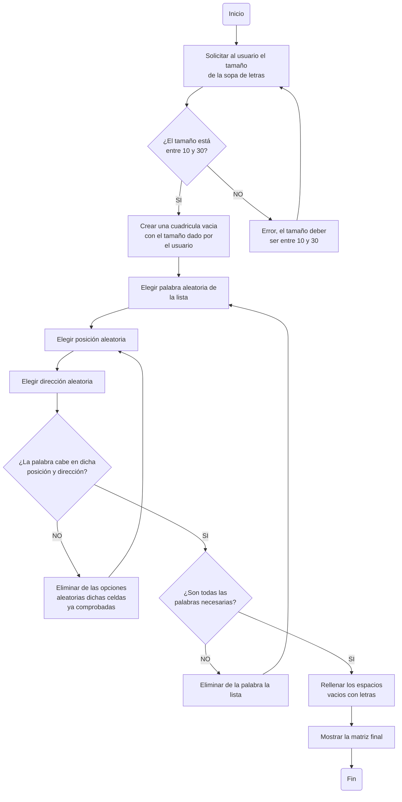

# ProyectoProgramacion-Sopa-de-Letras
En el presente repositorio se desarrollará una aplicación que emule una sopa de letras utilizando el lenguaje de programación 'Python' para la materia de **Programación Básica**.

Grupo **The Porycodens**, integrado por:
- Santiago Montoya.
- Robert Andrés Calderón.
- Eduard Enrique Avellaneda.

# **Condiciones**

Para la elaboración del proyecto, se plantearon las siguientes condiciones:

1. Código original.
   
2. Uso de herramientas vistas en el curso.
   
3. Interacción y manejo a través de la consola.
   
4. Definidido por el usuario:
     - Matriz del tamaño de la sopa de letras (Min: 10x10, Max: 30x30).
     - Ingreso de las palabras: Lista de coordenadas, Strings.
     - Nivel de dificultad: Asociado a cantidad de palabras, verticales, horizontales, diagonal.

# **Diagrama de Flujo Representativo**


# **Creación de Pseudocódigo**

Se lleva lo planteado en el diagrama de flujo a un esquema de organización diferente, creando un pseudocódigo que nos ayude a organizar y entender de manera más efecticva el programa de la sopa de letras:

```pseudocode
INICIO ALGORITMO: Sopa de Letras
#Importar modulos necesarios

importar random
importar string

#variables

tamaño:entero
Lista_de_Palabras:lista

#Función para crear cuadricula

Escribir el "tamaño" de la sopa de letras
leer tamaño:
   si tamaño >= 10 y tamaño <= 30 entonces
      crear cuadricula vacia de tamaño x tamaño
   sino
      Pedir al usuario que ingrese un valor dentro del rango

#Función para ingresar las palabras de Lista_de_Palabras en la cuadricula

Elegir aleatoriamente de la lista una palabra
   Escoger en que dirección y posición va esa palabra
      Verificar si esa palabra cabe en esa posición
         Si la palabra cabe en la cuadricula:
            ponerla en esa posición y eliminarla de la lista de opciones
         sino
            eliminar la dirección y posición de la palabra, e intentar de nuevo
   
#Rellenar la cuadricula con letras aleatorias (con funciones o lista)
Para cada espacio de la cuadrícula representado con ".", rellenar con una letra aleatoria (funciones o lista)


Mostrar la cuadricula con las palabras y las letras al usuario

FIN ALGORITMO

```

# **Preguntas Importantes a Respondernos antes de ir al código**

1. ¿Cómo podemos delimitar el tamaño de cuadricula para el usuarío?
   
- Con una condición, un while, permitiendo que el valor este dentro de los rangos permitidos.

   - El while es fácil de entender y modificar.
   - En un simple bucle podemos ahorrar varias líneas de código.
   - No se detiene en caso de que el usuarío ingresa valores fuera de los rangos.

```python

while 10 <= tamaño <= 30:         #se tiene que cumplir esta condición
```

2. ¿Cómo determinar la dificultad del juego?

- Al igual que con la condición del 'tamaño', hacemos uso del bucle.

   - Pedir al usuario que ingrese la dificultad, dentro de 3 niveles 1,2 y 3.
   - Verificar si el dato de entrada es uno de estos 3, si así lo es, determinar esa dificultad, sino, pedir de nuevo al usuario ingresar un dato válido.

```python
while dif not in [1,2,3]:        #la dificultad tendra 3 niveles: Facil - Solo palabras Horizontales
                                                                # Intermedio - Palabra Verticales y Horizontales
                                                                # Dificil - Palabras Verticales, Horizontales y Diagonales
``` 

3. ¿Cómo apartir del tamaño ingresado del usuario, crear la cuadricula de la sopa?

- Usando una lista de listas, es decir, una matriz, para representar la forma normal de una sopa de letras.

   - Se crea según el tamaño qye digite el usuario (mismas filas, mismas columnas).
   - Poner cualquier tipo de identificador para llenar la lista provisionalmente, puede ser con espacios, puntos etc. Emplearemos puntos.
 
``` python
matriz = [["." for x in range(tamaño)] for y in range(tamaño)]  #aquí nos aseguramos que tanto las filas (x) como las columnas (y) se rellenen con "."
``` 
4. ¿Cómo poner las palabras dentro de la cuadricula ya creada, de manera aleatoria?

- Hay que hacer uso  del import random, esto nos va a permitir elegir la posición aleatoria.

   - Elegir una posición aleatoria en la fila.
   - Elegir una posición aleatoria en la columna.
   - Hay que verificar que dicha palabra quepa, sino, intentar una posición hasta que lo haga.
   - Luego de ingresar la primera palabra, comprobar que desde la segunda en adelante, la posición escogida no se sobreponga sobre una ya existente.

``` python
import random

def insertar_palabra(matriz, tamaño, palabra, dificultad):

fila = random.randint(0, tamaño - 1)
columna = random.randint(0, tamaño - 1)
``` 

5. ¿Cómo se llena la sopa de letras con letras aleatorias?

- Una vez puestas todas las palabras, hay que rellenar lo faltante con letras aleatorias.
  
   - Lo faltante, en este caso, vendrian siendo toda posición con "." en ella.
   - Hay que recorrer toda la matriz y reemplazar.
   - Aquí también hay que emplear random, y ademas el import de string, con la finalidad de poder acceder a los elementos del codigo ASCII para elegir letras al azar.

``` python
import random
import string

for x in range(len(matriz)):                        #hay que recorrer cada fila
   for y in range(len(matrix[x]))                   #y luego recorrer cada elemento en la fila, para encontrar los "." a reemplazar

random.choice(string,ascii_uppercase)              #aquí se selecciona una letra random, del lenguaje ASCII, y se pone el uppercase para solo poder seleccionar mayusculas, para así evitar poner otro tipo de elementos, como números.
``` 
6. Ahora tenemos la sopa de letras ya formada, hay que encontrar las palabras. ¿Pero cómo?

- Empezando, se le solicita al usuario la palabra encontrada.

   - Se recorre la cuadrícula completa.
   - Se verifica si la palabra encontrada pertenece a la lista de palabras que se encuentran dentro de la sopa de letras.
   - Y ahora, una vez se verifique que la palabra encontrada sea correcta, resaltamos la misma para generar un cambio visual en la matriz (sopa de letras), podemos hacerlo con paréntesis.
 
``` python
for x in range(len(matriz)):                        #hay que emplear el range para recorrer toda la cuadricula
   for y in range(len(matrix[x]))

                                                       #tenemos que emplear un condicional "if" para verificar que la palabra, se encuentre en la lista de palabras 
``` 

7. Listo, el usuario ha encontrado todas las palabras, pero hay que tener un puntaje para hacer más divertido el juego.

- Entonces, el puntaje se realiza conforme a cada palabra encontrada, aumentado por cada una respectivamente.

   - Cada palabra encontrada tiene que valer cierta cantidad 2 - 5 - 10, no importa, lo importante es que tenga un valor y este sea acumulable para la totalidad de las palabras, para tener un puntaje final.
   - Una vez registrada una palabra, hay que removerla para evitar que el usuario pueda sumar más de los puntos asignados por palabra, con la misma palabra.
  
``` python
puntaje = 0                        #inicializamos una variable con el nombre puntaje, dicha variable guardara como resultado el acumulado del puntaje

while palabras > 0:                      # se incicia un bucle teniendo como condición "palabras" siendo la lista donde se guardan las palabras, valga la redundancia, esto asegura que se repita el proceso de verificar el puntaje, hasta que "palabras" quede vacio
   palabra_encontrada = input("Ingrese una palabra encontrada: ")
   if palabra_encontrada in palabras:
      encontrar palabras(matriz, palabra_encontrada)
      palabras.remove(palabra_encontrada)           #se elimina la palabra encontrada con la para evitar repetir la misma palabra
      puntaje += i                                 #siendo i cualquier valor, el puntaje que se poonga a cada palabra encontrada
print(f"Puntaje total: {puntaje}")
``` 

8. Bueno, ya tenemos todo.. ¿o no?, bueno, tal vez podriamos agregar algo más, como un temporizador, hacerlo con tiempo.

- Listo, tenemos que para esto, importar time para llevarlo acabo.

``` python
import time

def temporizador(segundos:int):
  while segundos > 0:                          #se crea un bucle
    minutes, seconds = segundos//60, segundos%60           #esto lo que hace es poner los minutos como enteros y poner a su lado los segundos restantes
    print (f"{minutes: }:{seconds: }")             
    time.sleep(1)                     #este es el avance que va a tener el temporizador, en este caso va de segundo en segundo
    segundos -= 1                     #y pues se hace la cuenta regresiva

``` 


# **Desglose Final del Código**

## **Función Crear Cuadrícula**

Esta función es relativamente sencilla, nada más hay que crear una lista de listas (matriz) y que tanto el primer indexador [x] -> filas, como el segundo [y] -> columnas, tengan la misma cantidad de elementos, determinado por el usuario con la entrada "tamaño".

``` python
def crear_cuadrícula(tamaño):                                           #crear la cuadricula, con el tamaño ingresado por el usuario (vacia)
  matriz = [["." for x in range(tamaño)] for y in range(tamaño)]        #recorre cada fila y cada elemento vacio en cada una de estas y los reemplaza por "."
  return matriz
```
## **Función Insertar Palabras**

En el proyecto esta es la función más larga de todas, teniendo que comprobar múltiples condiciones y parámetros para poder llevarse acabo correctamente.

``` python
def insertar_palabra_simple(matriz, tamaño, palabra, dificultad):                       #se crea la función que tendrá como argumento a matriz, tamaño, palara, dificultad (como mencionamos, hay que tener en cuenta y comprobar bastantes elementos)
  palabra_len = len(palabra)             
  intentos = 100                                                                        #esta función es prueba y error, y limitamos el número de intentos a 100
  while intentos>0:                                                                     #se inicia el bucle
    fila_inicial = random.randint(0, tamaño - 1)                                        #en cada intento, se escogera un número aleatorio entre 0 y el tamaño de la cuadricula - 1
    col_inicial = random.randint(0, tamaño - 1) 
```
Vamos a explicar las dificultades posibles:

``` python
if difcultad == 1           
if dificultad == 2
if dificultdad == 3
```
## **Función Encontrar Palabras**

Para la función encontrar palabras, función que nos resulto la más compleja, primero definimos la función y los argumentos que tomaría:

``` python
def encontrar_palabras(matriz, palabra):  
  tamañoM = len(matriz)                            #se le agrega a la variable tamañoM el valor de la longitud de la matriz
  palabra_len = len(palabra)                       #y a palabra_len se le asigno el mismo valor de la longitud de la palabra a encontrar
```
Luego, se recorre primero las filas(x) y luego las columnas (y).

``` python
def encontrar_palabras(matriz, palabra):  
  tamañoM = len(matriz)  
  palabra_len = len(palabra)  
  for x in range (tamañoM):                        #recorre las filas
    for y in range (tamañoM - palabra_len):            #recorre las columnas teniendo cuidado de no salirse de la cuadricula
```
Una vez recorridas las filas y las columnas, esto para las palabras ubicadas horizontalmente.

``` python
def encontrar_palabras(matriz, palabra):
  tamañoM = len(matriz)
  palabra_len = len(palabra)
  for x in range (tamañoM):                       
    for y in range (tamañoM - palabra_len + 1):         
      if "".join(matriz[x][y:y + palabra_len]) == palabra:                   #toma una sublista de la fila, en un rango que va desde y hasta y+
        for i in range(palabra_len):
          matriz[x][y + i] = f"({matriz[x][y + i]})"                       #resalta las palabras horizontales
``` 
Se realiza lo mismo con pequeñas variaciones, destacando tanto las palabras verticiales:

``` python
  for y in range(tamañoM):
    for x in range(tamañoM - palabra_len + 1):                     #aquí se agrega el uno, ya que el rango en range, el final no lo toma, toma el anterior, por ende habia que incluirlo
      if "".join(matriz[x + i][y] for i in range(palabra_len)) == palabra:                    #lo mismo que con las palabras verticales, en este caso el rango seria en filas (x) y no en columnas (y)
        for i in range(palabra_len):
          matriz[x + i][y] = f"({matriz[x + i][y]})"              #resalta las palabras verticales
```
Finalizado el conteo de las palabras en vertical, así se estaria viendo con el conteo en horizontal:


``` python
def encontrar_palabras(matriz, palabra):
  tamañoM = len(matriz)
  palabra_len = len(palabra)
  for x in range (tamañoM):
    for y in range (tamañoM - palabra_len):
      if "".join(matriz[x][y:y + palabra_len]) == palabra:
        for i in range(palabra_len):
          matriz[x][y + i] = f"({matriz[x][y + i]})"
  for y in range(tamañoM):
    for x in range(tamañoM - palabra_len + 1):
      if "".join(matriz[x + i][y] for i in range(palabra_len)) == palabra:
        for i in range(palabra_len):
          matriz[x + i][y] = f"({matriz[x + i][y]})"
``` 

Ahora, queda destacar las diagonales:

``` python
  for x in range(tamañoM - palabra_len + 1):                           
    for y in range(tamañoM - palabra_len + 1):
      if "".join(matriz[x + i][y + i] for i in range(palabra_len)) == palabra:
        for i in range(palabra_len):
          matriz[x + i][y + i] = f"({matriz[x + i][y + i]})"               #en las pasadas aumentaba o en x (para las horizontales) o en y (para las verticales), en este caso las diagonales aumentan las 2, como en escalerita
``` 
El resultado ya en completo, queda así:

``` python
  tamañoM = len(matriz)
  palabra_len = len(palabra)
  for x in range (tamañoM):
    for y in range (tamañoM - palabra_len):
      if "".join(matriz[x][y:y + palabra_len]) == palabra:
        for i in range(palabra_len):
          matriz[x][y + i] = f"({matriz[x][y + i]})"
  for y in range(tamañoM):
    for x in range(tamañoM - palabra_len + 1):
      if "".join(matriz[x + i][y] for i in range(palabra_len)) == palabra:
        for i in range(palabra_len):
          matriz[x + i][y] = f"({matriz[x + i][y]})"
  for x in range(tamañoM - palabra_len + 1):
    for y in range(tamañoM - palabra_len + 1):
      if "".join(matriz[x + i][y + i] for i in range(palabra_len)) == palabra:
        for i in range(palabra_len):
          matriz[x + i][y + i] = f"({matriz[x + i][y + i]})"
``` 
## **Puntaje**
Para dar un "incentivo" en la resolución de la sopa de letras, se hace uso de puntajes para hacer más entretenida la experiencia:

``` python
 puntaje = 0
  while len(palabras)>0:
    palabra_encontrada = input("\nIngrese una palabra encontrada: ").strip().upper()             #.strip() y .upper() se usan para que todas las palabras ingresadas esten en el mismo formato
    if palabra_encontrada in palabras:
      encontrar_palabras(matriz, palabra_encontrada)  
      palabras.remove(palabra_encontrada)                                                        #si la palabra encontrada esta en palabras, se elimina
      puntaje += 10                                                                              #por cada palabra encontrada se suma 10 puntos
      print(f"¡Bien hecho! Puntaje total: {puntaje}") 
      for i in matriz:
       print(" ".join(i))                                                                    
  print(f"El juego ha terminado. \n Su puntaje final es: {puntaje}")
``` 

## **Función Principal**

``` python
if __name__ == "__main__":
  print("¡Bienvenido a esta sopa de letras! \nA continuación, vamos a determinar sus condiciones.")
  tamaño = int(input("\n- Ingrese el tamaño de la sopa de letras (10-30): "))
  while tamaño < 10 or tamaño > 30:
    tamaño = int(input("- Por favor, ingrese un tamaño válido (10-30): ")) 
  #Primera interacción del Usuario con el programa, en este el programa solicita al usuario las condiciones 
  #siendo la primera de estas el tamaño de la cuadricula, en caso de que este dato no sea valido, entra en un bucle hasta que sea ejecutable.


  palabras = input("- Ingrese las palabras a encontrar (separadas por espacios): ").strip().upper().split()
  #Por este lado tenemos el ingreso de las palabras deseadas por el usuario para la sopa de letras, pasando por los metodos de strip, upper y split.
  #strip retorna las palabras sin espacios, upper las retorna en mayusculas sostenidas y split separa los caracteres de una palabra en una lista.

  dificultad = int(input("- Ingrese la dificultad deseada: \n 1. Fácil. \n 2. Intermedia \n 3. Difícil \n --> "))
  while dificultad not in [1, 2, 3]:
    dificultad = int(input("Por favor, ingrese una dificultad válida (1, 2 o 3): "))
  #En esta siguiente interacción con el programa, este solicita la dificultad deseada, la cual consta de 3 niveles y funciona con el mismo sistema del tamaño.
  #Esto es para que si se ingresa un valor no deseado el programa no se rompa al entrar en un ciclo.

  matriz = crear_cuadrícula(tamaño)
 
  for i in palabras:
    insertar_palabra_simple(matriz, tamaño, i, dificultad)
  
  rellenar_matriz(matriz)
  #Este es el llamado de las funciones con los datos ingresados por el usuario.
  
  tiempo_total = int(input("\n- Ingrese el tiempo total (en segundos) deseado para resolver la sopa de letras: "))
  #Ingreso de los segundos deseados por el usuario, y asi darle valor a la variable.

  print("\nSopa de letras generada:")

  for i in matriz:
    print(" ".join(i))
  #Impresión de la sopa de letras.
 

  print("\nEl tiempo ha comenzado! Mucha suerte.")
  temporizador(tiempo_total)
  #Impresión de el temporizador con el tiempo seleccionado por el usuario.
``` 

# **Demostración**
Como primer aparición al ejecutar el codigo, aparece el siguiente texto e input:

``` markdown
¡Bienvenido a esta sopa de letras! 
A continuación, vamos a determinar sus condiciones.

- Ingrese el tamaño de la sopa de letras (10-30): 15
``` 
Ingresado el número 15:

``` markdown
¡Bienvenido a esta sopa de letras! 
A continuación, vamos a determinar sus condiciones.

- Ingrese el tamaño de la sopa de letras (10-30): 15
- Ingrese las palabras a encontrar (separadas por espacios): Casa Programación 
```
Ingresadas dichas palabras:

``` markdown
¡Bienvenido a esta sopa de letras! 
A continuación, vamos a determinar sus condiciones.

- Ingrese el tamaño de la sopa de letras (10-30): 15
- Ingrese las palabras a encontrar (separadas por espacios): Casa Programación 
- Ingrese la dificultad deseada: 
 1. Fácil. 
 2. Intermedia 
 3. Difícil 
```
Puesta como dificultad la número 2:

``` markdown
¡Bienvenido a esta sopa de letras! 
A continuación, vamos a determinar sus condiciones.

- Ingrese el tamaño de la sopa de letras (10-30): 15
- Ingrese las palabras a encontrar (separadas por espacios): Casa Programación 
- Ingrese la dificultad deseada: 
 1. Fácil. 
 2. Intermedia 
 3. Difícil 
 --> 2
Decida la dirección para agregar la palabra: 
 - 'H': Para horizontales 
 - 'V': Para verticales 
  Aquí su decisión:  h
```
Se selecciono como primera dirección y v como segunda, tomando un total de 4 intentos para poner las palabras en la cuadricula.

``` markdown
Decida la dirección para agregar la palabra: 
 - 'H': Para horizontales 
 - 'V': Para verticales 
  Aquí su decisión:  h
La palabra 'CASA' no ha podido ser colocada conforme a la dirección H 
Decida la dirección para agregar la palabra: 
 - 'H': Para horizontales 
 - 'V': Para verticales 
  Aquí su decisión:  h
Decida la dirección para agregar la palabra: 
 - 'H': Para horizontales 
 - 'V': Para verticales 
  Aquí su decisión:  v
La palabra 'PROGRAMACIÓN' no ha podido ser colocada conforme a la dirección V 
Decida la dirección para agregar la palabra: 
 - 'H': Para horizontales 
 - 'V': Para verticales 
  Aquí su decisión:  v
```

Luego de esto se pide al usuario el tiempo para resolver la sopa de letras:

``` markdown
- Ingrese el tiempo total (en segundos) deseado para resolver la sopa de letras: 10
``` 

Puesto el número, se imprime la sopa de letras y empieza el temporizador con el la cuenta atras:


``` markdown
Sopa de letras generada:
D M U O M J Q O S P Q Q B X E
F O J A H S R T S R A E L Z I
U C A S A L G K Y O Q O M X J
R R G X Y T X I T G F T T L Y
V M G C F C E S U R Q Y W A Q
W M L G G L X L X A V O X C E
U U A W N P W F K M Z H K J Q
L O H T L U Z Z U A C R W G G
G Y J D I E A U X C H R I Q C
U N S W M V Z P Z I D R E K U
A K W Z P B Q W H Ó M D X T R
Q E C Z U I R A X N G A A Z W
O S W W I J D H X H V E P N F
Q T G C L V H W A T K W Q Q O
V G Z G Q E I R R R B T Q J D

El tiempo ha comenzado! Mucha suerte.
00:10
00:09
00:08
00:07
00:06
00:05
00:04
00:03
00:02
00:01
¡El tiempo ha finalizado!

Ingrese una palabra encontrada:

```
Ingresadas las dos palabras, el programa finaliza y se imprime lo siguiente:

``` markdown
Ingrese una palabra encontrada: programación
¡Bien hecho! Puntaje total: 20
D M U O M J Q O S (P) Q Q B X E
F O J A H S R T S (R) A E L Z I
U (C) (A) (S) (A) L G K Y (O) Q O M X J
R R G X Y T X I T (G) F T T L Y
V M G C F C E S U (R) Q Y W A Q
W M L G G L X L X (A) V O X C E
U U A W N P W F K (M) Z H K J Q
L O H T L U Z Z U (A) C R W G G
G Y J D I E A U X (C) H R I Q C
U N S W M V Z P Z (I) D R E K U
A K W Z P B Q W H (Ó) M D X T R
Q E C Z U I R A X (N) G A A Z W
O S W W I J D H X H V E P N F
Q T G C L V H W A T K W Q Q O
V G Z G Q E I R R R B T Q J D
El juego ha terminado. 
 Su puntaje final es: 20
```


# **GRACIAS**
