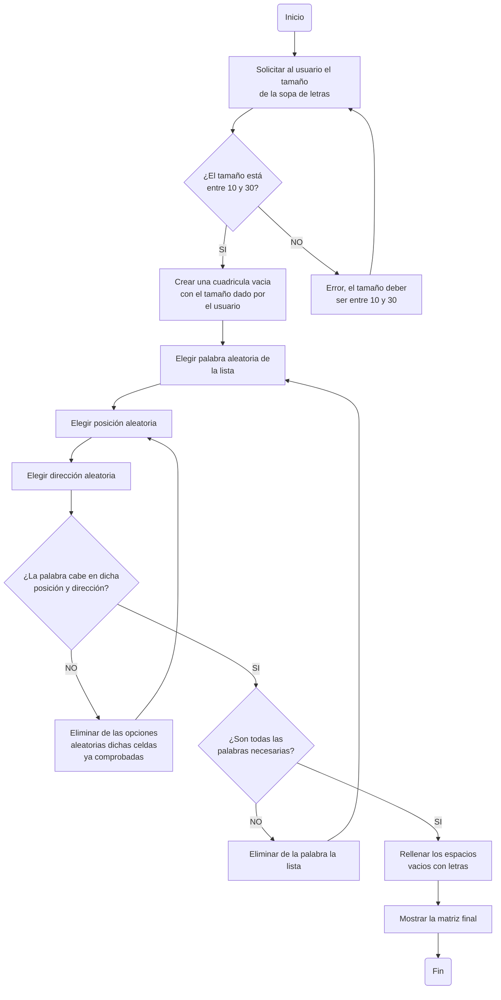

# ProyectoProgramacion-Sopa-de-Letras
En el presente repositorio se desarrollará una aplicación que emule una sopa de letras utilizando Python para la materia de **Programación**

Grupo **The Porycodens**, integrado por:
- Santiago Montoya.
- Robert Andrés Calderón.
- Eduard Enrique Avellaneda.

# **Condiciones**

Para la elaboración del proyecto, se plantearon las siguientes condiciones:

1. Código original.
   
2. Uso de herramientas vistas en el curso.
   
3. Interacción y manejo a través de la consola.
   
4. Definidido por el usuario:
     - Matriz del tamaño de la sopa de letras (Min: 10x10, Max: 30x30)
     - Ingreso de las palabras: Lista de coordenadas, Strings.
     - Nivel de dificultad: Asociado a cantidad de palabras, verticales, horizontales, diagonal.


# **Desarrollo Inicial**

Para empezar con este proyecto, se tenía que primero plantear cómo se llevaríamos a cabo con el conocimiento que teníamos. A continuación, presentamos el enfoque inicial:

**1. Estructura del Programa**

El programa estará dividido en varias funciones para hacerlo modular y volverlo comprensible:

- Inicio del programa:

  - Mostrar el menú principal.

  - Solicitar al usuario el tamaño de la sopa de letras (validando que esté entre 10x10 y 30x30).

**2. Generación de la sopa de letras:**

  - Crear la cuadrícula como una cadena de texto con puntos (.) para representar espacios vacíos.

  - Rellenar los espacios vacíos con letras aleatorias (aqui hariamos uso del import random y llamada de archivos).

**3. Mostrar la sopa de letras:**

- Imprimir la cuadrícula en la consola de forma legible.

# **Desarrollo del Codigo**

Para empezar, primero teniamos que importar los modulos "string" y "random".

**- String:** Nos permite importar todas las letras del alfabeto en ingles, estas mismas se utilizaran para rellenar la sopa de letras.

**- Random:** Hace que las letras importadas gracias a "string" se puedan ubicar aleatoriamente en la cuadricula de la sopa de letras, así como escoger aleatorimante la dirección en que se dispondran las palabras.

# **Diagrama de Flujo Representativo**


# **Creación de Pseudocódigo**

Para llevar lo planteado en el diagrama de flujo a un estilo más parecido al codigo sin serlo como tal, creamos un pseudocódigo q nos ayudara a organizar la sopa de letras:

```pseudocode
INICIO ALGORITMO: Sopa de Letras
#Importar modulos necesarios

importar random
importar string

#variables

tamaño:entero
Lista_de_Palabras:lista

#Función para crear cuadricula

Escribir el "tamaño" de la sopa de letras
leer tamaño:
   si tamaño >= 10 y tamaño <= 30 entonces
      crear cuadricula vacia de tamaño x tamaño
   sino
      Pedir al usuario que ingrese un valor dentro del rango

#Función para ingresar las palabras de Lista_de_Palabras en la cuadricula

Elegir aleatoriamente de la lista una palabra
   Escoger en que dirección y posición va esa palabra
      Verificar si esa palabra cabe en esa posición
         Si la palabra cabe en la cuadricula:
            ponerla en esa posición y eliminarla de la lista de opciones
         sino
            eliminar la dirección y posición de la palabra, e intentar de nuevo
   
#Rellenar la cuadricula con letras aleatorias (con funciones o lista)
Para cada espacio de la cuadrícula representado con ".", rellenar con una letra aleatoria (funciones o lista)


Mostrar la cuadricula con las palabras y las letras al usuario

FIN ALGORITMO

```

