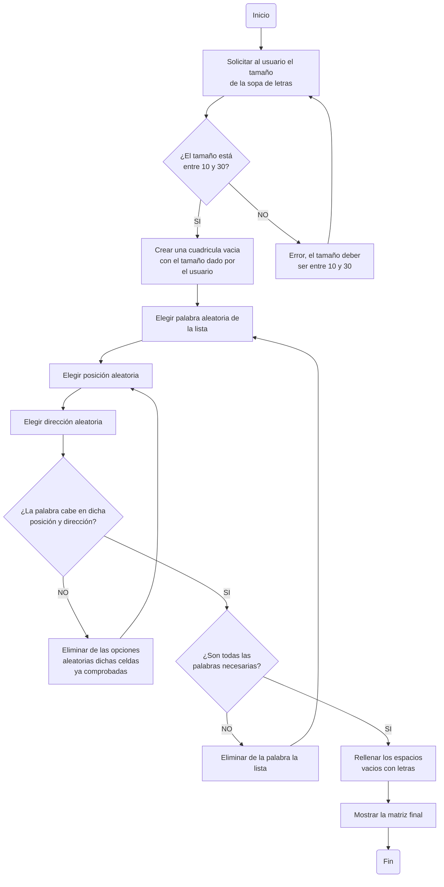

# ProyectoProgramacion-Sopa-de-Letras
En el presente repositorio se desarrollará una aplicación que emule una sopa de letras utilizando Python para la materia de **Programación**

Grupo **The Porycodens**, integrado por:
- Santiago Montoya.
- Robert Andrés Calderón.
- Eduard Enrique Avellaneda.

# **Condiciones**

Para la elaboración del proyecto, se plantearon las siguientes condiciones:

1. Código original.
   
2. Uso de herramientas vistas en el curso.
   
3. Interacción y manejo a través de la consola.
   
4. Definidido por el usuario:
     - Matriz del tamaño de la sopa de letras (Min: 10x10, Max: 30x30)
     - Ingreso de las palabras: Lista de coordenadas, Strings.
     - Nivel de dificultad: Asociado a cantidad de palabras, verticales, horizontales, diagonal.

# **Diagrama de Flujo Representativo**


# **Creación de Pseudocódigo**

Para llevar lo planteado en el diagrama de flujo a un estilo más parecido al codigo sin serlo como tal, creamos un pseudocódigo q nos ayudara a organizar la sopa de letras:

```pseudocode
INICIO ALGORITMO: Sopa de Letras
#Importar modulos necesarios

importar random
importar string

#variables

tamaño:entero
Lista_de_Palabras:lista

#Función para crear cuadricula

Escribir el "tamaño" de la sopa de letras
leer tamaño:
   si tamaño >= 10 y tamaño <= 30 entonces
      crear cuadricula vacia de tamaño x tamaño
   sino
      Pedir al usuario que ingrese un valor dentro del rango

#Función para ingresar las palabras de Lista_de_Palabras en la cuadricula

Elegir aleatoriamente de la lista una palabra
   Escoger en que dirección y posición va esa palabra
      Verificar si esa palabra cabe en esa posición
         Si la palabra cabe en la cuadricula:
            ponerla en esa posición y eliminarla de la lista de opciones
         sino
            eliminar la dirección y posición de la palabra, e intentar de nuevo
   
#Rellenar la cuadricula con letras aleatorias (con funciones o lista)
Para cada espacio de la cuadrícula representado con ".", rellenar con una letra aleatoria (funciones o lista)


Mostrar la cuadricula con las palabras y las letras al usuario

FIN ALGORITMO

```

# **Preguntas Importantes a Respondernos antes de ir al codigo**

1. ¿Cómo podemos delimitar el tamaño de cuadricula para el usuarío?
   
- Con una condición, un while, con la finalidad de que el valor este dentro de los rangos permitidos.

   - El while es facil de entender y modificar.
   - En un simple bucle podemos ahorrarnos varias líneas de codigo.
   - No para si el usuarío ingresa valores fuera de los rangos.

```python

while 10 <= tamaño <= 30:         #se tiene que cumplir esta condición
```

2. ¿Cómo determinar la dificultad del juego?

- Al igual que con la condición del tamaño, podemos hacer uso del bucle.

   - Pedir al usuario que ingrese la dificultad, dentro de 3 niveles 1,2 y 3.
   - Verificar si el dato de entrada es uno de estos 3, si así lo es, determinar esa dificultad, sino, pedir de nuevo al usuario ingresar un dato valido.

```python
while dif not in [1,2,3]:        #la dificultad tendra 3 niveles: Facil - Solo palabras Horizontales
                                                                # Intermedio - Palabra Verticales y Horizontales
                                                                # Dificil - Palabras Verticales, Horizontales y Diagonales
``` 

3. ¿Cómo apartir del tamaño ingresado del usuario, crear la cuadricula de la sopa?

- Usando una lista de listas, osea una matriz, para representar la forma normal de una sopa de letras.

   - Hay que crearla del tamaño del usuario.
   - Poner cualquier tipo de identificador para llenar la lista provicionalmente, puede ser con espacios, puntos etc. Emplearemos puntos.
 
``` python
matriz = [["." for x in range(tamaño)] for y in range(tamaño)]  #aquí nos aseguramos que tanto las filas (x) como las columnas (y) se rellenen con "."
``` 
4. ¿Cómo poner las palabras dentro de la cuadricula ya creada, de manera aleatoria?

- Hay que hacer uso  del import random, esto nos va a permitir elegir la posición aleatoria.

   - Elegir una posición aleatoria en la fila.
   - Elegir una posición aleatoria en la columna.
   - Hay que verificar que dicha palabra quepa, sino, intentar una posición hasta que lo haga.
   - Luego de ingresar la primera palabra, comprobar que desde la segunda en adelante, la posición escogida no se sobreponga sobre una ya existente.

5. ¿Cómo se llena la sopa de letras con letras aleatorias?

- Una vez puestas todas las palabras, hay que rellenar lo faltante con letras aleatorias.
  
   - Lo faltante, en este caso, vendrian siendo toda posición con "." en ella.
   - Hay que recorrer toda la matriz y reemplazar.

6. Ahora tenemos la sopa de letras ya formada, hay que encontrar las palabras. ¿Pero cómo?

- Principalmente, hay que pedirle al usarió la palabra encontrada.

   - Hay que recorrer la cuadricula completa.
   - Hay que verificar si la palabra encontrada, pertenece a la lista de palabras que se encuentran dentro de la sopa de letras.
   - Y ahora, hay que encontrar la manera de resaltar la palabra hallada, podemos hacerlo con parentesis.

7. Listo, el usuario ha encontrado todas las palabras, pero hay que tener un puntaje para hacer más divertido el juego.

- Entonces, el puntaje podriamos hacerlo basado en las palabras encontradas.

   - Cada palabra encontrada tiene que valer cierta cantidad 2 - 5 - 10, no importa, lo importante es que tenga un valor y este sea acumulable para la totalidad de las palabras, para tener un puntaje final.
   - Una vez registrada una palabra, hay que removerla para evitar que el usuario pueda sumar más de los puntos asignados por palabra, con la misma palabra.


8. Bueno, ya tenemos todo.. ¿o no?, bueno, tal vez podriamos agregar algo más, como un temporizador, hacerlo con tiempo.

- Listo, tenemos que para esto, importar time para llevarlo acabo.


